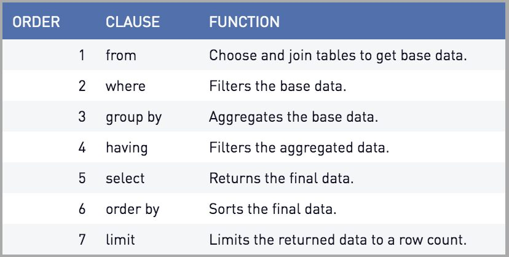

# SQL Fundamentals

## Intermediate SQL

### Lesson 02 - Filtering Records

SQL Order Execution:



### WHERE

1) Select the film_id and imdb_score from the reviews table and filter on scores higher than 7.0

```
SELECT film_id, imdb_score
FROM reviews
WHERE imdb_score > 7;
```

2) Select the film_id and facebook_likes of the first ten records with less than 1000 likes from the reviews table

```
SELECT film_id, facebook_likes
FROM reviews
WHERE facebook_likes < 1000
LIMIT 10;
```

3) Count how many records have a num_votes of at least 100,000; use the alias films_over_100K_votes

```
SELECT COUNT(film_id) as films_over_100K_votes
FROM reviews
WHERE num_votes > 100000;
```

4) Count the Spanish-language films

```
SELECT COUNT(language) as count_spanish
FROM films
WHERE language = 'Spanish';
```

### Multiple Criteria

- OR: WHERE color = 'yellow' OR length = 'short';
- AND: WHERE color = 'yellow' AND length = 'short';
- BETWEEN: WHERE buttons BETWEEN 1 AND 5;

Combine individual clauses:
- WHERE (release_year = 1994 OR release_year = 1995) AND (certification = 'PG' OR certification = 'R');
- WHERE release_year BETWEEN 1994 AND 2000 AND country='UK';

5) Select the title and release_year for all German-language films released before 2000

```
SELECT title, release_year
FROM films
WHERE language = 'German' AND release_year < 2000;
```

6) Select all details for German-language films released after 2000 but before 2010 using only WHERE and AND

```
SELECT *
FROM films
WHERE language = 'German' AND release_year > 2000 AND release_year < 2010;
```

7) Select the title and release_year for films released in 1990 or 1999 using only WHERE and OR

```
SELECT title, release_year
FROM films
WHERE release_year = 1990 OR release_year = 1999
```

8) Use BETWEEN with AND on the films database to get the title and release_year of all Spanish-language films released between 1990 and 2000 (inclusive) with budgets over $100 million.

```
SELECT title, release_year
FROM films
WHERE release_year BETWEEN 1990 AND 2000 AND budget > 100000000 AND language = 'Spanish';
```

### Filtering Text

Filter a **pattern** rather than specific text
- LIKE
- NOT LIKE
- IN

**LIKE**: Used to search for a pattern in a field
- % match zero, one, or many characters
- _ match a single character

**IN**: WHERE release_year IN (1920, 1930, 1940);

9) Select the names of all people whose names begin with 'B'

```
SELECT name
FROM people
WHERE name LIKE 'B%';
```

10) Select the names of people whose names have 'r' as the second letter

```
SELECT name
FROM people
WHERE name LIKE '_r%';
```

11) Select the names of people whose names don't start with 'A'

```
SELECT name
FROM people
WHERE name NOT LIKE 'A%';
```

12) Select the title and release_year of all films released in 1990 or 2000 that were longer than two hours

```
SELECT title, release_year
FROM films
WHERE release_year IN (1990, 2000) AND duration > 120;
```

13) Select the title and language of all films in English, Spanish, or French using IN

```
SELECT title, language
FROM films
WHERE language IN ('English', 'Spanish', 'French');
```

14) Select the title, certification and language of all films certified NC-17 or R that are in English, Italian, or Greek

```
SELECT title, certification, language
FROM films
WHERE certification IN ('NC-17', 'R') AND language IN ('English', 'Italian', 'Greek');
```

### NULL values

- COUNT(field_name) includes only non-missing values
- COUNT(*) includes missing values

Use IS NULL or IS NOT NULL to:
- Identify missing values
- Select missing values
- Exclude missing values

15) Select the title of every film that doesn't have a budget associated with it and use the alias no_budget_info

```
SELECT title as no_budget_info
FROM films
WHERE budget IS NULL;
```

16) Count the number of films with a language associated with them and use the alias count_language_known

```
SELECT COUNT(*) as count_language_known
FROM films
WHERE language IS NOT NULL;
```