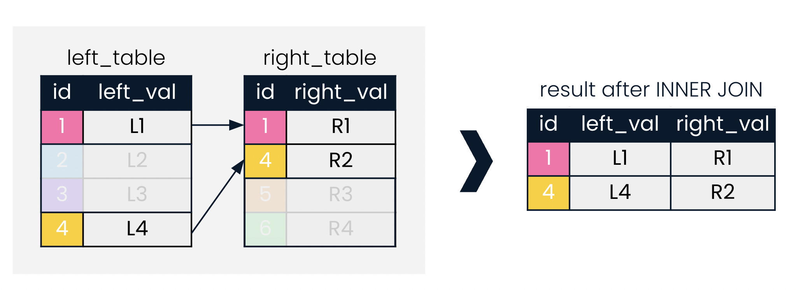

# SQL Fundamentals

## Joining Data in SQL

### Lesson 01 - Introducing Inner Joins

INNER JOIN looks for records in **BOTH** tables which match on a given field.



Example:

```
SELECT prime_ministers.country, prime_ministers.continent, prime_minister, president
FROM presidents
INNER JOIN prime_ministers
ON presidents.country = prime_ministers.country;
```

Aliasing tables:

```
FROM presidents AS p1
INNER JOIN prime_ministers AS p2
ON p1.country = p2.country;
```

1) Perform an inner join with the cities table on the left and the countries table on the right. Join ON the country_code and code columns.

```
SELECT * 
FROM cities
INNER JOIN countries
ON cities.country_code = countries.code;
```

2) 

```
SELECT cities.name AS city, countries.name AS country, countries.region
FROM cities
INNER JOIN countries
ON cities.country_code = countries.code;
```

### Joining with aliased tables

3) 

```
SELECT c.code AS country_code, name, year, inflation_rate
FROM countries AS c
INNER JOIN economies AS e
ON c.code = e.code
```

Notice that only the code field is ambiguous, so it requires a table name or alias before it. All the other fields (name, year, and inflation_rate) do not occur in more than one table name, so do not require table names or aliasing in the SELECT statement.

4) Use the country code field to complete the INNER JOIN with USING

```
SELECT c.name AS country, l.name AS language, official
FROM countries AS c
INNER JOIN languages AS l
USING(code)
```

### Defining relationships

- One-to-many (eg. one singer, many songs)
- One-to-one (eg. finger, fingerprint)
- Many-to-many (eg. countries, languages)

5) 

```
SELECT c.name AS country, l.name AS language
FROM countries AS c
INNER JOIN languages AS l
USING(code)
WHERE l.name = 'Bhojpuri';
```

### Multiple joins

6) 

```
SELECT name, e.year, fertility_rate, unemployment_rate
FROM countries AS c
INNER JOIN populations AS p
ON c.code = p.country_code
INNER JOIN economies AS e
ON c.code = e.code
AND e.year = p.year;
```