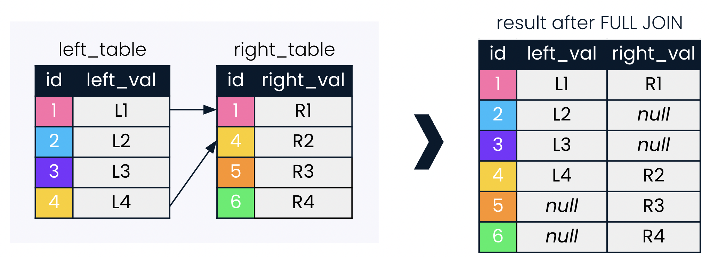

# SQL Fundamentals

## Joining Data in SQL

### Lesson 02 - Outer Joins, Cross Joins and Self Joins

### LEFT and RIGHT JOINs

**LEFT JOIN** will return all records in the left table, and those records in the right table that match on the joining field provided.


- RIGHT JOIN is less commonly used than LEFT JOIN
- Any RIGHT JOIN can be re-written as a LEFT JOIN
- LEFT JOIN feels more intuitive to users when typing from left to right

1) 

```
SELECT c1.name AS city, code, c2.name AS country
FROM cities AS c1
LEFT JOIN countries AS c2
ON c1.country_code = c2.code
ORDER BY code DESC;
```

2) 

```
SELECT region, AVG(gdp_percapita) AS avg_gdp
FROM countries AS c
LEFT JOIN economies AS e
USING(code)
WHERE year = 2010
GROUP BY region
ORDER BY avg_gdp DESC
LIMIT 10;
```

### FULL JOINs

A FULL JOIN combines a LEFT JOIN and a RIGHT JOIN.



3) Perform a full join with countries (left) and currencies (right).
Filter for the North America region or NULL country names.

```
SELECT name AS country, code, region, basic_unit
FROM countries
FULL JOIN  currencies
USING (code)
WHERE region = 'North America' OR name IS NULL
ORDER BY region;
```

4) 

```
SELECT c1.name AS country, region, l.name AS language,
FROM countries as c1
FULL JOIN languages as l
USING(code)
FULL JOIN currencies as c2
USING(code)
WHERE region LIKE 'M%esia';
```

### CROSS JOIN

**CROSS JOIN** creates all possible combinations of two tables.


CROSS JOIN can be incredibly helpful when asking questions that involve looking at all possible combinations or pairings between two sets of data.

5) 

```
SELECT c.name AS country, l.name AS language
FROM countries AS c
CROSS JOIN languages AS l
WHERE c.code in ('PAK','IND') AND l.code in ('PAK','IND');
```

6) 

```
SELECT c.name AS country, region, life_expectancy AS life_exp
FROM countries AS c
FULL JOIN populations AS p
ON c.code = p.country_code
WHERE year = 2010
ORDER BY life_expectancy
LIMIT 5;
```

### SELF joins

Self joins are tables joined with themselves. They can be used to compare parts of the same table.

7) 

```
SELECT p1.country_code, p1.size AS size2010, p2.size AS size2015
FROM populations AS p1
INNER JOIN populations AS p2
ON p1.country_code = p2.country_code
WHERE p1.year = 2010
AND p1.year = p2.year - 5;
```