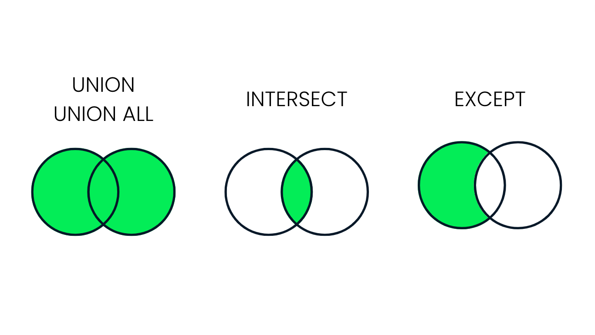
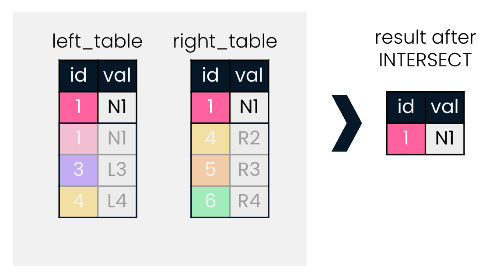
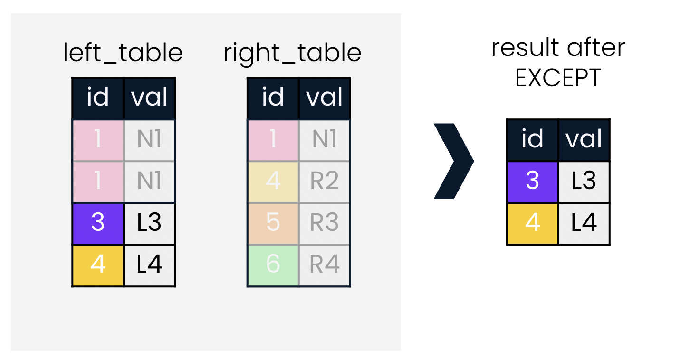

# SQL Fundamentals

## Joining Data in SQL

### Lesson 03 - Set Theory for SQL Joins



### UNION

**UNION** takes two tables as input, and returns all records from both tables.

**UNION ALL** takes two tables and returns all records from both tables, *including duplicates*.

Example:

```
SELECT *
FROM left_table
UNION
SELECT *
FROM right_table;
```

1) 

```
SELECT *
FROM economies2015
UNION
SELECT *
FROM economies2019
ORDER BY code, year;
```

2) 

```
SELECT code, year
FROM economies
UNION
SELECT country_code, year
FROM populations
ORDER BY code, year;
```

### INTERSECT



3) Return all city names that are also country names.

```
SELECT name
FROM countries
INTERSECT
SELECT name
FROM cities
```

### EXCEPT



4) Return all cities that do not have the same name as a country

```
SELECT name
FROM cities
EXCEPT
SELECT name
FROM countries
ORDER BY name;
```